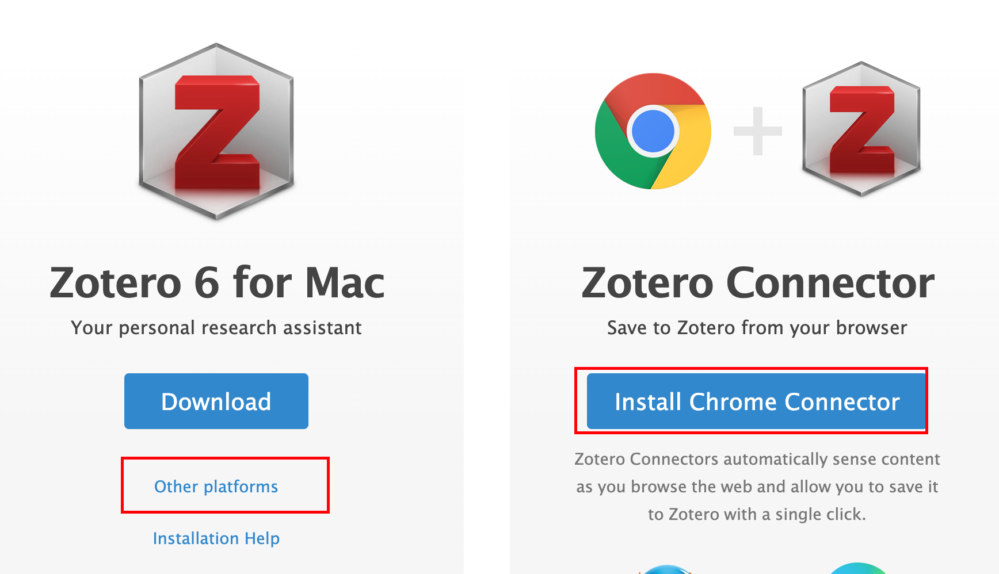
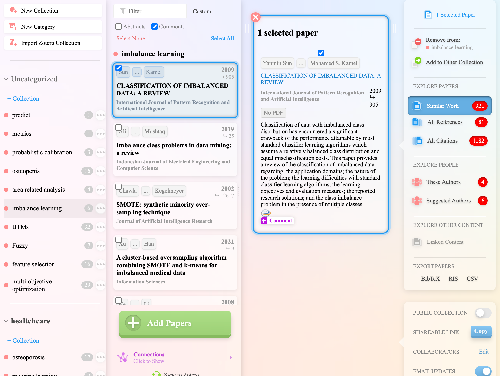
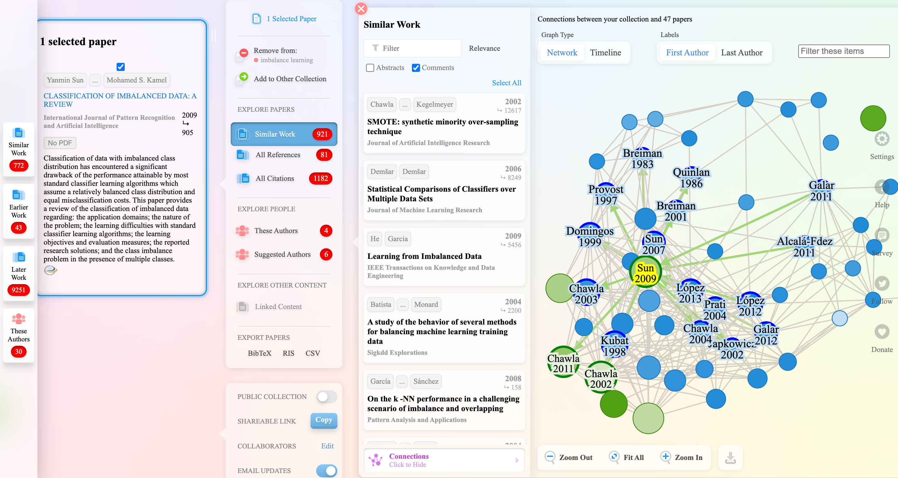
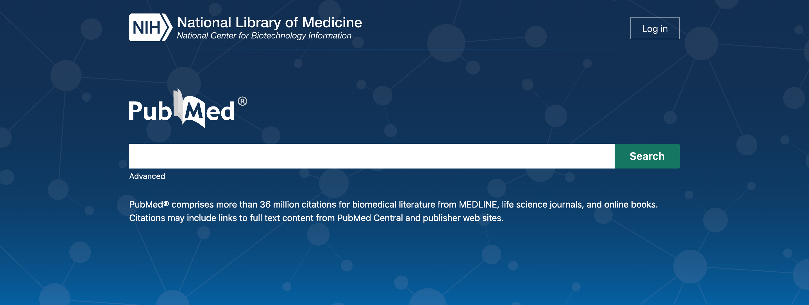
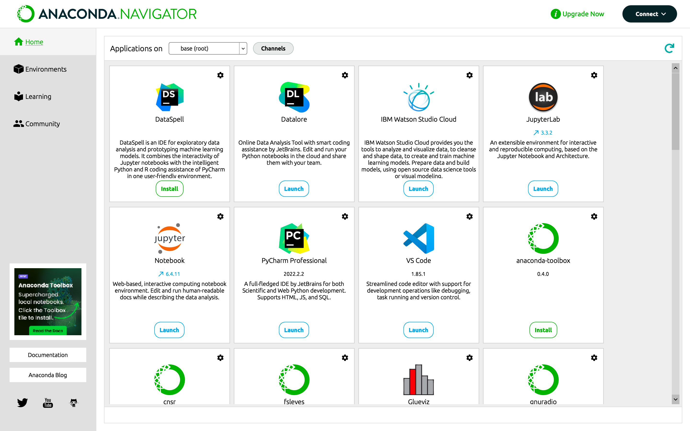
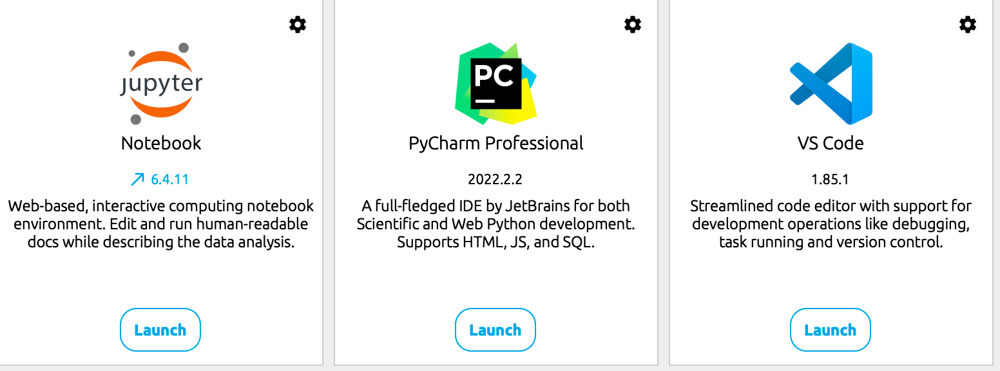

# 科研工具推荐
> —— BY YIN
### 文献管理
## zotero
官网： https://www.zotero.org/

Zotero的操作指南：https://zhuanlan.zhihu.com/p/98428625?from_voters_page=true

安装配置：https://zhuanlan.zhihu.com/p/499398620

下载： https://www.zotero.org/download/
Mac和windows（在红色框出的地方）

Zotero基础操作，比Endnote更好用的文献管理软件
https://www.bilibili.com/video/BV1ZE411p7qT/?spm_id_from=333.788.recommend_more_video.1&vd_source=214ff1ff5aa5dff40791b883cac458e1

## 文献搜索

### Research Rabbit
官网：https://researchrabbitapp.com/home
> 可以看看官网的介绍视频

文献管理

> 可查询该文献关联的文献（也就是具有相互引用的关系）以及时间和影响程度，点击文章就可以跳到文献的出处;可以自行探索一下功能

### Pubmed
> 这个应该会用到比较多，用于查医学生物方面的文献（不过上面的Research Rabbit会直接搜索各种相关的，有些是pubmed的文献也会直接跳转过去）

官网：
https://pubmed.ncbi.nlm.nih.gov/

> **显示影响因子的插件**
【研究生】Pubmed插件大全 | 显示期刊影响因子 | Pubmedplus Easypubmed Easy scholar
https://www.bilibili.com/video/BV1SL4y1M7ht/?spm_id_from=333.337.search-card.all.click&vd_source=214ff1ff5aa5dff40791b883cac458e1
快速查看分区影响因子Easy scholar
https://www.bilibili.com/video/BV1A94y1C7yk/?spm_id_from=333.788.recommend_more_video.1&vd_source=214ff1ff5aa5dff40791b883cac458e1

### SCI-HUB
官网： https://sci-hub.hkvisa.net/

## ResearchGate
官网 https://www.researchgate.net/

## 医学统计

**北京大学 医学统计学与 SPSS 软件（基础篇）**
https://www.bilibili.com/video/BV1z741117eS/?spm_id_from=333.337.search-card.all.click&vd_source=214ff1ff5aa5dff40791b883cac458e1
（ps： 我看过这个就是通过这个学的spss，感觉还不错）

**B站强推！2023公认最通俗易懂的【数据分析】教程，200集付费课程（附数据集）Excel Python**
https://www.bilibili.com/video/BV1xm4y1a7nG?p=7&vd_source=214ff1ff5aa5dff40791b883cac458e1

**7小时搞定Excel可视化+Excel数据透视表+数据分析三剑客**
https://www.bilibili.com/video/BV1Rg4y1k7nm/?spm_id_from=333.337.search-card.all.click&vd_source=214ff1ff5aa5dff40791b883cac458e1

> 这里只是推荐，如果看了觉得一般，可以上b站搜其他的看看，找适合你的教程

## Python （Anaconda）下载
如果要下载python，推荐直接下载Anaconda，然后按官网的一步一步来就好了。
官网：https://docs.anaconda.com/free/anaconda/install/windows/
使用界面：

可以直接使用各种python环境

主要可能下面这三个会用的比较多

